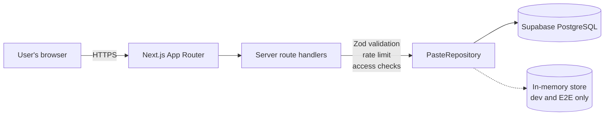
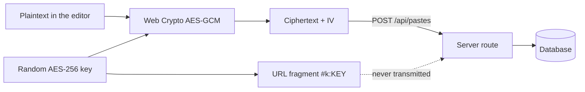

# TinyPaste

**Share text without the noise.**

A privacy-focused pastebin. Paste text, code, logs or configuration, choose how long it lives
and who can read it, and share a short link. No account, no tracking, no feed.

---

## Screenshots

> _Screenshots are not committed to the repository. To capture your own, run the app locally and
> photograph `/` (the editor) and `/p/<slug>` (a paste with syntax highlighting) in both themes._

| Screen | Path |
| --- | --- |
| Editor | `/` |
| Paste view | `/p/<slug>` |
| Recent (local only) | `/recent` |

---

## Features

- **Paste anything textual** — around thirty languages with syntax highlighting, plus plain text.
- **Expiry** — 10 minutes, 1 hour, 1 day, 7 days, 30 days, or never. Enforced on every read path.
- **Password protection** — bcrypt-hashed, rate limited, never revealed before it verifies.
- **Burn after reading** — destroyed atomically on the first deliberate open.
- **Browser-side encryption** — AES-GCM in the browser; the server only ever stores ciphertext,
  and the key lives in the URL fragment where it never reaches a server.
- **Edit and delete without an account** — a 256-bit edit token, stored in your browser, hashed in
  the database.
- **Recent pastes** — a per-browser list. There is no global feed and no server-side listing API.
- **Fork** — open any paste you can read as the starting point for a new one.
- **Raw and download routes** with sanitised filenames and inert content types.
- **QR codes**, generated locally so an encrypted link is never sent to a third party.
- **Command palette** (`Ctrl`/`Cmd` + `K`) and keyboard shortcuts.
- **Light, dark and system themes**, with no flash on load.

See [docs/FEATURES.md](docs/FEATURES.md) for the full list with implementation status.

---

## Architecture



The encrypted path never lets plaintext or the key reach the server:



On the way back out, the browser fetches the ciphertext by slug and decrypts it locally using the
key it reads from `window.location.hash`.

Full detail: [docs/ARCHITECTURE.md](docs/ARCHITECTURE.md).

---

## Tech stack

| Concern | Choice | Why |
| --- | --- | --- |
| Framework | Next.js 16 (App Router) | Server components for reads, route handlers for mutations |
| Language | TypeScript, `strict` + `noUncheckedIndexedAccess` | |
| Styling | Tailwind CSS v4 | Design tokens defined once in `app/globals.css` |
| Database | Supabase PostgreSQL | Row Level Security, atomic SQL for burn-after-read |
| Validation | Zod | One schema per server boundary |
| Highlighting | Shiki (`codeToTokens`) | Tokens rendered as React elements — no `dangerouslySetInnerHTML` |
| Passwords | bcryptjs | Pure JS, so it runs unchanged on serverless |
| Encryption | Web Crypto (AES-GCM) | Native, audited, no home-grown cryptography |
| Icons | lucide-react | |
| QR | qrcode-generator | Tiny, dependency-free, renders locally |
| Tests | Vitest + Playwright | |

---

## Local setup

```bash
npm install
```

```bash
cp .env.example .env.local
```

```bash
npm run dev
```

The app runs at <http://localhost:3000>.

**Without Supabase credentials it still works.** The repository layer falls back to a volatile
in-memory store, and a banner across the top of every page says so. Data disappears when the server
restarts (a JSON snapshot in `.data/pastes.json` softens that in development). This mode is refused
in a production build unless you explicitly set `TINYPASTE_ALLOW_MEMORY_DB=true`.

To use a real database, follow [docs/SUPABASE_SETUP.md](docs/SUPABASE_SETUP.md) and fill in
`NEXT_PUBLIC_SUPABASE_URL` and `SUPABASE_SERVICE_ROLE_KEY`.

### Environment variables

| Variable | Required | Purpose |
| --- | --- | --- |
| `NEXT_PUBLIC_SUPABASE_URL` | for durable storage | Supabase project URL |
| `NEXT_PUBLIC_SUPABASE_ANON_KEY` | no | Present for completeness; RLS denies it access to `pastes` |
| `SUPABASE_SERVICE_ROLE_KEY` | for durable storage | **Server only.** Bypasses RLS |
| `APP_URL` | recommended | Public origin used to build share links |
| `RATE_LIMIT_REDIS_URL` / `RATE_LIMIT_REDIS_TOKEN` | production | Upstash Redis REST, for cross-instance rate limiting |
| `RATE_LIMIT_CREATE` / `RATE_LIMIT_UNLOCK` / `RATE_LIMIT_MUTATE` | no | Override the default limits |
| `ABUSE_CONTACT_EMAIL` | no | Turns the footer "Report abuse" link into a `mailto:` |
| `CLEANUP_SECRET` | no | Enables `POST /api/cleanup`; the route is disabled without it |
| `TINYPASTE_DB_DRIVER` | no | `supabase` or `memory`; auto-detected when unset |
| `TINYPASTE_ALLOW_MEMORY_DB` | no | Explicit opt-in to volatile storage in production |
| `NEXT_PUBLIC_REPOSITORY_URL` | no | Adds a "Source" link to the footer |

---

## Scripts

| Command | What it does |
| --- | --- |
| `npm run dev` | Development server |
| `npm run build` | Production build |
| `npm run start` | Serve the production build |
| `npm run lint` | ESLint |
| `npm run typecheck` | `tsc --noEmit` |
| `npm run test` | Vitest unit tests |
| `npm run test:e2e` | Playwright end-to-end tests — run `npm run build` first; the suite serves that build |
| `npm run check` | lint → typecheck → test → build |

---

## Folder structure

```
app/                     Routes (App Router)
  page.tsx               Editor
  about/  privacy/       Static content
  recent/                Per-browser history
  p/[slug]/              Paste view
    raw/  download/      Export routes
    edit/                Owner-only edit screen
  api/                   Route handlers
components/
  editor/                Create and edit forms
  layout/                Header, footer, storage notice
  paste/                 Viewer, gates, code block, dialogs
  ui/                    Button, field, toast, theme toggle, time
lib/
  api/                   Response shapes and route guards
  client/                Browser-only: history, fetch client, clipboard, theme store
  config/                Branding, constants, environment access
  crypto/                AES-GCM, base64, URL fragment handling
  db/                    PasteRepository + Supabase and in-memory implementations
  paste/                 Service layer, languages, expiry, slugs, highlighting
  security/              Passwords, tokens, rate limiting, headers, logging
  utils/                 Filenames, time formatting
  validation/            Zod schemas
supabase/migrations/     SQL schema and functions
tests/unit/              Vitest
tests/e2e/               Playwright
docs/                    Architecture, security, setup, deployment, features
```

---

## Security design

Full write-up in [docs/SECURITY.md](docs/SECURITY.md). The short version:

- **Pasted content never executes.** Shiki tokens are rendered as React elements, so paste content
  cannot become markup. `dangerouslySetInnerHTML` appears exactly once in the codebase, for the
  theme bootstrap script, which contains no user data.
- **Raw and download responses** are `text/plain` / `application/octet-stream` with `nosniff` and
  their own `default-src 'none'; sandbox` policy.
- **Passwords** are bcrypt hashes (cost 12). Plaintext is never stored or logged.
- **Edit tokens** are 256-bit random values stored as SHA-256 digests and compared in constant time.
- **Access checks** all funnel through `lib/paste/service.ts`, so no route can skip expiry or burn
  state.
- **RLS is on with no policies**, so the anon key cannot read a single row. All access is
  server-side with the service-role key.
- **Logging** never receives paste bodies, passwords, tokens or keys.

### Browser-side encrypted pastes

Choosing *Encrypt in browser*:

1. A random 256-bit AES-GCM key is generated with the Web Crypto API.
2. The plaintext is encrypted with a fresh 96-bit IV **before** the request is built.
3. Only `{ ciphertext, iv, encryptionVersion }` is sent. `encryption_version` is stored so the
   format can change later without breaking old pastes.
4. The key is placed in the URL fragment as `#k:<base64url>`. Browsers do not send fragments in
   requests, so it never reaches the server, a proxy, or an access log.
5. Opening the link fetches the ciphertext by slug and decrypts locally.

Failure modes are explicit: a missing fragment shows *"Encryption key missing from this URL."*, and
a wrong key or damaged payload shows *"Unable to decrypt this paste."* There is no fallback to
server-side plaintext, because none exists.

**Encryption and password protection are mutually exclusive in version 1.** Combining them would
mean two independent secrets guarding one payload, with confusing recovery semantics and no real
security gain — the fragment key already provides confidentiality against the server, which is what
the password cannot do. The constraint is enforced in the UI, in the Zod schema, and by a `CHECK`
constraint in the database.

### Burn after reading

Precisely defined, because the edge cases matter:

- **Creating a paste does not consume it.** The creator is redirected to `/p/<slug>?created=1`,
  which renders metadata and a warning, never the body.
- **Revealing is an explicit `POST`** to `/api/pastes/<slug>/reveal`, triggered by clicking
  *Reveal and destroy*. A GET would let a prefetch, a chat-app link preview or a crawler destroy the
  paste before the recipient ever opened it.
- **The claim is atomic.** In Postgres, `consume_burn_paste()` takes a row lock with
  `SELECT … FOR UPDATE` and only proceeds while `burned_at IS NULL`, so with N simultaneous readers
  exactly one receives the content. The in-memory store gets the same guarantee for free from
  Node's single-threaded execution. Both are covered by tests.
- **The payload is wiped** in the same transaction it is handed out.
- **Password-protected burn pastes** are consumed only through `/unlock`, and only after the
  password verifies — a wrong guess cannot destroy someone's paste.
- **Encrypted burn pastes** burn when the ciphertext is delivered; decryption happens afterwards,
  locally.
- **Raw and download refuse burn pastes** rather than consuming them.
- **Burn pastes cannot be edited.** Editing a payload that is destroyed on first read is
  meaningless, so the API rejects it.

---

## Testing

```bash
npm run test
```

199 unit tests covering slug generation and validation, expiry arithmetic and boundary conditions,
filename sanitisation (traversal, header injection, reserved names), language-to-extension mapping,
password hashing and verification, edit-token generation and constant-time verification,
encryption round-trips plus wrong-key/tampered/truncated/version failures, fragment handling, rate
limiting, security headers, repository behaviour including burn concurrency, and the service layer's
access control.

```bash
npm run build && npm run test:e2e
```

46 Playwright tests covering the create → view → copy/raw/download → fork loop, expiring pastes,
password lock and unlock, editing and deleting with a creator token, rejection of forged tokens,
encrypted paste creation and decryption, missing and wrong keys, burn-after-read semantics including
a concurrent double-reveal, XSS payload rendering, security headers, and metadata privacy.

E2E runs against the in-memory store, so it needs no Supabase project.

---

## Deployment

Target: Vercel + Supabase. Step-by-step in [docs/DEPLOYMENT.md](docs/DEPLOYMENT.md).

Expired rows are removed by `POST /api/cleanup` (bearer `CLEANUP_SECRET`), best wired to a Vercel
Cron job. Expiry correctness does not depend on it — it only stops expired data lingering at rest.

---

## Limitations

- **Anyone with the link can read a paste.** Slugs are unguessable, but they are not access control.
- **For pastes that are not browser-encrypted, the operator can read the content.** That is
  inherent to server-side storage; encryption is the answer if it matters.
- **A reader can copy a paste** before it expires or burns.
- **The default rate limiter is per-instance.** On serverless, configure Upstash so the limit is
  shared across instances.
- **The CSP needs `'unsafe-inline'` for scripts**, which the App Router's inline bootstrap requires.
  A nonce-based policy would need middleware on every request.
- **Hosting infrastructure may keep its own access logs**, including IP addresses and paths. That is
  outside the application's control and is stated plainly on `/privacy`.
- **Abuse reporting is a `mailto:` link**, not a moderation workflow.
- **The E2E suite runs Chromium only.**

---

## Roadmap

Optional accounts · paste collections · API keys and a documented public API · a CLI client · a
browser extension · webhooks · collaborative editing · custom expiry values · custom domains ·
encrypted file sharing · paste diffing and versions · a real report-and-moderation workflow ·
self-hosting guides.

See [docs/FEATURES.md](docs/FEATURES.md) for what is implemented, partial and planned.

---

## Licence

No licence file is included yet — add one before publishing.
