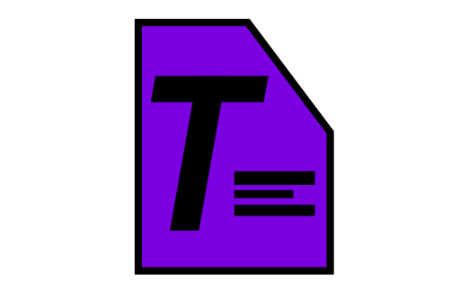
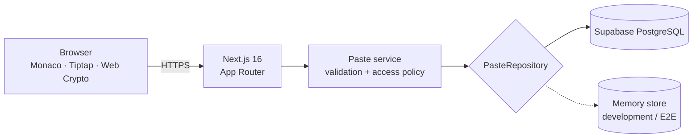

<p align="center">
  <picture>
    <source media="(prefers-color-scheme: dark)" srcset="./docs/assets/tinypaste-logo-dark.png">
    <source media="(prefers-color-scheme: light)" srcset="./docs/assets/tinypaste-logo-light.png">
    
  </picture>
</p>

<h1 align="center">TinyPaste</h1>

<p align="center"><strong>Share code, plain text, and formatted documents without accounts,
tracking, or a public feed.</strong></p>

TinyPaste is a privacy-minded pastebin built with Next.js and Supabase. It gives each paste an
unguessable link, lets the author choose how long it survives, and keeps ownership in the creating
browser through a one-time edit token. For material that should be hidden even from the server,
TinyPaste can encrypt the payload in the browser before upload.


---

## Features

| Mode | Editor | Stored form | Reader experience |
| --- | --- | --- | --- |
| Code | Monaco | Source text + language | Shiki syntax highlighting, line numbers, raw view, download |
| Plain text | Monaco | Unhighlighted text | Clean text view, raw view, download |
| Document | Tiptap | Validated ProseMirror JSON | Headings, lists, quotes, links, colours, rich copy, HTML/Markdown export |

All three modes support expiration, password protection, burn-after-reading, browser encryption,
forking, editing, deletion, QR sharing, and browser-local history. A paste's content type and
security mode are fixed at creation so an edit cannot reinterpret or silently downgrade stored data.

## Quick start

Requirements: a current Node.js release supported by Next.js 16 and npm.

```bash
npm install
cp .env.example .env.local
npm run dev
```

Open <http://localhost:3000>. Supabase is optional for local development: without its credentials,
TinyPaste uses a clearly labelled in-memory store and writes a development snapshot to
`.data/pastes.json`. That mode is volatile and is rejected in production unless explicitly enabled.

For durable storage, follow the [Supabase setup guide](docs/SUPABASE_SETUP.md).

## How private is it?

TinyPaste offers two different confidentiality models:

| Protection | Who can read? | What the server stores |
| --- | --- | --- |
| Link only | Anyone with the link | Plaintext |
| Password | Anyone with the link and password | Plaintext + bcrypt password hash |
| Browser encryption | Anyone with the complete link, including its `#k:` fragment | Ciphertext only |

Browser encryption is the option to use when the server itself must not see the content. The
browser creates a random 256-bit key, encrypts with AES-GCM, uploads only ciphertext and an IV, and
places the key after `#` in the share URL. URL fragments are not included in HTTP requests.

Important limits:

- TinyPaste cannot stop an authorised reader from copying content before it expires or burns.
- Losing an encryption fragment or the browser's edit token is permanent; the server cannot recover
  either value.
- Password protection and browser encryption cannot be combined in the current format.
- Infrastructure providers may retain access logs or backups outside the application's control.

Read the complete [security model](docs/SECURITY.md) before operating a public instance.

## Feature snapshot

- Up to **1 MiB** per paste and titles up to **120 characters**.
- **32 code languages**, with Monaco while editing and lazily loaded Shiki grammars while reading.
- Expiration after **10 minutes, 1 hour, 1 day, 7 days, 30 days, or never**.
- Passwords hashed with bcrypt (cost 12) and rate-limited unlock attempts.
- Burn-after-reading via an explicit, atomic claim; only one concurrent reader receives the payload.
- Rich documents with headings, lists, quotes, code blocks, safe links, alignment, text colour, and
  highlighting.
- Edit, delete, fork, copy, QR code, raw/download routes, and document export.
- Light, dark, and system themes; keyboard shortcuts; command palette; mobile layout.
- Consistent JSON errors, secure response headers, safe filenames, and `noindex` paste pages.

The maintained implementation matrix is in [docs/FEATURES.md](docs/FEATURES.md).

## Architecture at a glance



The service layer is the policy boundary: routes do not talk directly to storage, and every read
passes the same expiry, burn, and password checks. PostgreSQL supplies the atomic burn operation;
the browser owns encryption, local history, edit-token storage, and rich-document export.

See [docs/ARCHITECTURE.md](docs/ARCHITECTURE.md) for request flows, data boundaries, API routes,
and the storage model.

## Configuration

Copy `.env.example` to `.env.local`. The most important settings are:

| Variable | When needed | Purpose |
| --- | --- | --- |
| `NEXT_PUBLIC_SUPABASE_URL` | Durable storage | Supabase project URL |
| `SUPABASE_SERVICE_ROLE_KEY` | Durable storage | Server-only database credential; never expose it to the browser |
| `NEXT_PUBLIC_SUPABASE_ANON_KEY` | Optional | Reserved for future browser use; current RLS rules deny table access |
| `APP_URL` | Recommended | Canonical origin used in generated share links |
| `RATE_LIMIT_REDIS_URL` / `RATE_LIMIT_REDIS_TOKEN` | Public/serverless deploys | Shared Upstash rate limiting across instances |
| `CLEANUP_SECRET` | Optional | Enables authenticated expired-row cleanup |
| `ABUSE_CONTACT_EMAIL` | Optional | Activates the footer's abuse-report email link |
| `TINYPASTE_DB_DRIVER` | Optional | Force `supabase` or `memory`; normally auto-detected |
| `TINYPASTE_ALLOW_MEMORY_DB` | Test/demo only | Explicitly permit volatile storage in production mode |

The [deployment guide](docs/DEPLOYMENT.md) contains the complete production checklist.

## Development commands

| Command | Purpose |
| --- | --- |
| `npm run dev` | Start the development server |
| `npm run lint` | Run ESLint |
| `npm run typecheck` | Check TypeScript without emitting files |
| `npm run test` | Run the Vitest unit suite |
| `npm run build` | Create a production build |
| `npm run test:e2e` | Run Playwright against a production build |
| `npm run check` | Run lint, typecheck, unit tests, and build in sequence |

The current suite contains **272 unit tests** and **65 Chromium end-to-end tests**. It covers the
service and repository layers, encryption leak checks, document validation and rendering, XSS
payloads, ownership, password and burn flows, exports, security headers, and concurrent reveals.

```bash
npm run check
npm run test:e2e
```

Playwright uses the in-memory repository, so the test suite does not require a Supabase project.

## Repository map

```text
app/                     Pages and route handlers
  api/                   Create, read, unlock, reveal, mutate, cleanup
  p/[slug]/              Paste view, edit, raw, and download routes
components/
  editor/                Monaco and Tiptap authoring surfaces
  paste/                 Gates, renderers, actions, dialogs, QR code
  layout/  ui/           Application shell and reusable controls
lib/
  api/                   Request guards and response helpers
  client/                Browser history, API client, clipboard, theme
  crypto/                AES-GCM and fragment-key handling
  db/                    Repository contract and storage implementations
  document/              Rich-document schema, conversion, safe links/colours
  paste/                 Service layer, languages, expiry, highlighting
  security/              Passwords, tokens, headers, logging, rate limits
  validation/            Zod schemas at server boundaries
supabase/migrations/     Database schema, functions, and content-type migration
tests/unit/              Vitest logic and security tests
tests/e2e/               Playwright product flows
docs/                    Operations and design documentation
```

## Documentation

Start with the [documentation index](docs/README.md), or go directly to:

- [Features and product behaviour](docs/FEATURES.md)
- [Architecture and API](docs/ARCHITECTURE.md)
- [Security model and review checklist](docs/SECURITY.md)
- [Supabase setup](docs/SUPABASE_SETUP.md)
- [Production deployment](docs/DEPLOYMENT.md)

## Contributing

Keep business rules in `lib/paste/service.ts`, storage behind `PasteRepository`, and request data
behind the Zod schemas. Any change to access control, document structure, encryption, exports, or
database invariants should include focused unit tests and an end-to-end path where user-visible
behaviour changes. Run `npm run check` before opening a change.

## Licence

No licence file is currently included. Treat the source as all rights reserved until the project
owner adds an explicit licence.
