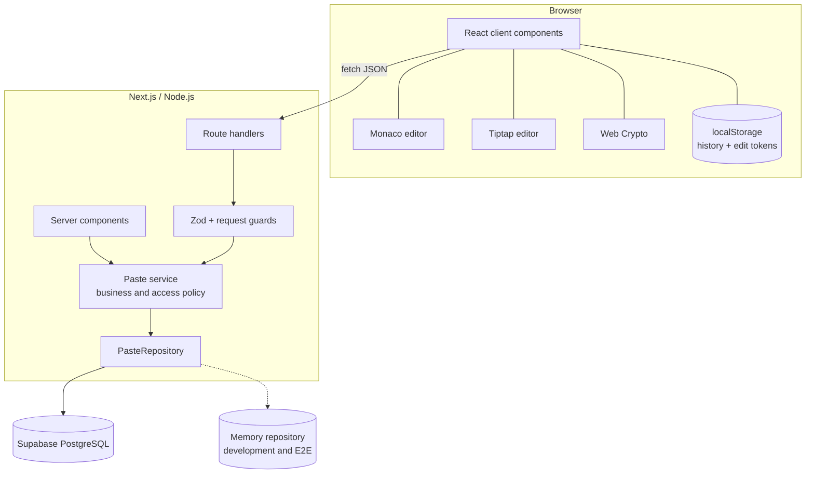
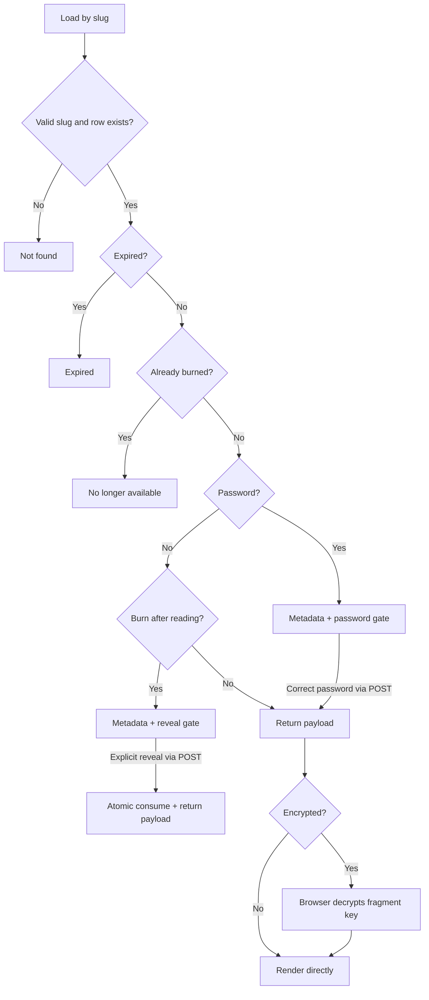
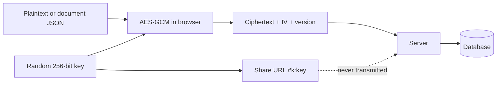

# Architecture

TinyPaste is a Next.js App Router application with a deliberately narrow server core. Pages and API
handlers translate HTTP; one service module owns product policy; a repository interface isolates
storage. The browser owns editing, local history, client-side encryption, and rich-document export.

## System map



## Design rules

1. **Routes do not own business rules.** They parse a request, call the service, and format a result.
2. **Every readable row passes one gate.** `loadPasteRecord()` applies slug, existence, expiry, and
   burn-state checks before content-specific policy runs.
3. **Storage does not know HTTP.** Repository implementations receive typed records and return typed
   records.
4. **Secrets are projected, not subtracted.** Client metadata is assembled from an explicit field
   list; hashes and internal IDs never enter a response object.
5. **Content type is immutable.** Code, plain text, and document payloads cannot be reinterpreted by
   an edit.
6. **Security mode is immutable.** Encryption, password, and burn flags cannot be downgraded later.

## Layers and ownership

| Layer | Location | Responsibility |
| --- | --- | --- |
| Pages and routes | `app/**` | URL shape, request parsing, status/response formatting |
| UI | `components/**` | Authoring, gates, rendering, actions, accessible interaction |
| API guards | `lib/api/**` | Same-origin checks, rate-limit entry points, edit-token extraction |
| Validation | `lib/validation/paste.ts` | Closed request schemas and byte limits |
| Service | `lib/paste/service.ts` | Creation, access control, ownership, expiry, burn, mutation |
| Document domain | `lib/document/**` | Closed JSON schema, safe links/colours, exports, plain-text conversion |
| Repository | `lib/db/**` | Storage contract, Supabase adapter, memory adapter |
| Security | `lib/security/**` | Passwords, tokens, headers, rate limits, safe logging |
| Browser helpers | `lib/client/**` | API calls, local history, clipboard, theme, fork state |

## Content model

A paste has one immutable `contentType`:

- `code`: a source string plus one of the supported language IDs.
- `plaintext`: an unhighlighted string; language is `plaintext`.
- `document`: `JSON.stringify` output from a closed ProseMirror schema.

The document schema recognises only known nodes and marks. It enforces safe URL protocols, safe CSS
colours, bounded text and arrays, a maximum depth of 64, and a maximum of 20,000 nodes. The reader
walks the validated structure directly into React elements. No stored HTML is rendered.

Encrypted pastes use the same logical content model, but the server sees only ciphertext. Document
JSON is validated before browser encryption and after browser decryption.

## Create flow

```mermaid
sequenceDiagram
    participant B as Browser
    participant A as POST /api/pastes
    participant S as Paste service
    participant R as Repository

    B->>B: Build code/text or validated document payload
    opt Browser encryption
        B->>B: Generate AES-256 key + 96-bit IV
        B->>B: Encrypt payload with AES-GCM
    end
    B->>A: Metadata + plaintext OR ciphertext/IV/version
    A->>A: Origin guard, create rate limit, Zod parse
    A->>S: createPaste(input)
    S->>S: Generate slug and 256-bit edit token
    S->>S: bcrypt password; SHA-256 edit token
    S->>R: Insert typed record
    R-->>S: Created row or slug collision
    S-->>A: Slug, URL, metadata, one-time edit token
    A-->>B: 201 Created
    B->>B: Save edit token locally; append encryption key to fragment
```

Creation retries with a fresh slug on a uniqueness collision. The raw edit token is returned exactly
once; storage receives only its digest.

## Read decision tree



Password and burn gates keep the body out of the initial page source. A burn action is a POST so
prefetchers, crawlers, and link previews cannot consume a paste with a GET.

## Atomic burn

The Supabase repository calls `consume_burn_paste()`. The function locks the matching row with
`SELECT … FOR UPDATE`, rechecks `burned_at IS NULL`, captures the payload, and nulls stored
content in the same transaction. Concurrent callers serialize on the row lock; exactly one gets the
payload. The memory repository performs the check-and-wipe synchronously.

For password-protected burn pastes, password verification happens before the atomic claim. Encrypted
burn pastes are consumed when ciphertext is delivered; decryption then happens locally.

## Browser-encryption boundary



The URL fragment is read through `window.location.hash`. It is not part of the request target,
headers, body, cookies, or server logs. A site-wide `Referrer-Policy: no-referrer` also prevents the
slug from being sent as referrer data.

## Storage selection

`lib/db/index.ts` selects one repository:

1. Use `TINYPASTE_DB_DRIVER` when explicitly set.
2. Otherwise use Supabase when both its URL and service-role key are present.
3. Otherwise use memory storage.

Memory storage is cached across development hot reloads and may snapshot to
`.data/pastes.json`. A production build refuses it unless `TINYPASTE_ALLOW_MEMORY_DB=true`, and
the UI shows a storage warning while it is active.

## Database shape

The `pastes` table contains:

| Category | Representative fields | Exposure |
| --- | --- | --- |
| Public metadata | slug, title, language, content type, timestamps, flags, views, size | Included selectively for link holders |
| Payload | plaintext content or encrypted content + IV + version | Returned only after service policy |
| Secrets | password hash, edit-token hash | Never returned |
| Internal identity | UUID primary key | Never returned |

The migrations enforce slug/title shapes, payload exclusivity, encryption/password incompatibility,
content-type values, document JSON syntax, non-negative size, and valid burn state. Application
validation remains stricter, especially for the document schema.

## API surface

These endpoints are internal product APIs, not a versioned public contract.

| Method | Path | Purpose | Authorisation |
| --- | --- | --- | --- |
| `POST` | `/api/pastes` | Create a paste | Same origin + create rate limit |
| `GET` | `/api/pastes/[slug]` | Metadata/payload when no server secret is needed | Link |
| `GET` | `/api/pastes/[slug]?edit=1` | Load editable payload | Edit-token header |
| `POST` | `/api/pastes/[slug]/unlock` | Verify password and return payload | Password + unlock rate limit |
| `POST` | `/api/pastes/[slug]/reveal` | Atomically consume burn paste | Explicit action |
| `PATCH` | `/api/pastes/[slug]` | Update editable fields | Edit-token header + mutate rate limit |
| `DELETE` | `/api/pastes/[slug]` | Delete record | Edit-token header + mutate rate limit |
| `POST` | `/api/cleanup` | Delete expired rows | Bearer `CLEANUP_SECRET` |
| `GET` | `/p/[slug]/raw` | Inert source text | Unprotected code/text only |
| `GET` | `/p/[slug]/download` | Attachment | Unprotected code/text only |

Edit tokens use `x-tinypaste-edit-token`, not URLs. There is deliberately no listing endpoint.

Successful and failed JSON responses use a consistent shape. Errors expose a closed code and safe
message; unexpected failures return a request ID rather than a stack trace.

## Rendering and export

- Monaco provides code/plain-text authoring from assets copied to the app's own origin.
- Shiki grammars are lazy-loaded one language at a time for read-only code rendering.
- Tiptap provides document authoring, but the reader uses the independent validated schema and React
  renderer.
- Code/text raw and download responses are produced on the server with inert headers.
- Document HTML and Markdown exports are generated locally from validated structure. The server raw
  and download routes reject document content.
- Protected content is copied, forked, downloaded, or exported only after it exists in browser
  memory.

## Client state

| Data | Location | Lifetime |
| --- | --- | --- |
| Recent entries and edit tokens | `localStorage` | Until forgotten, cleared, or the 200-entry cap evicts old records |
| Theme preference | `localStorage` | Until site data is cleared |
| Encryption key | URL fragment / memory | Present only in the complete link and current page |
| Fork seed | Module memory | Until consumed by the editor or the page reloads |

Fork state deliberately avoids persistent storage because it may contain decrypted plaintext.

## Failure model

- Invalid and unknown slugs look not found.
- Expired and burned records have explicit states but no payload.
- Missing encryption keys and failed authentication/decryption are distinct actionable UI states.
- A storage/configuration failure becomes `STORAGE_UNAVAILABLE`; it does not silently switch a
  production Supabase deployment to volatile storage.
- Upstash errors fall back to the per-instance limiter so a rate-limit service outage does not take
  the application offline.
