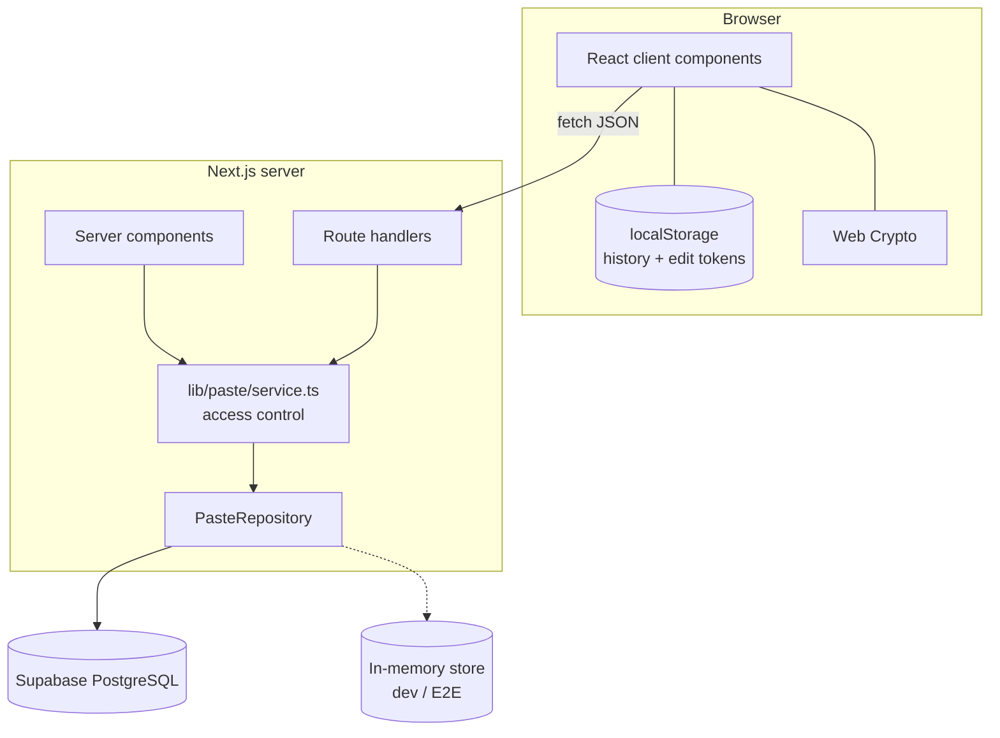
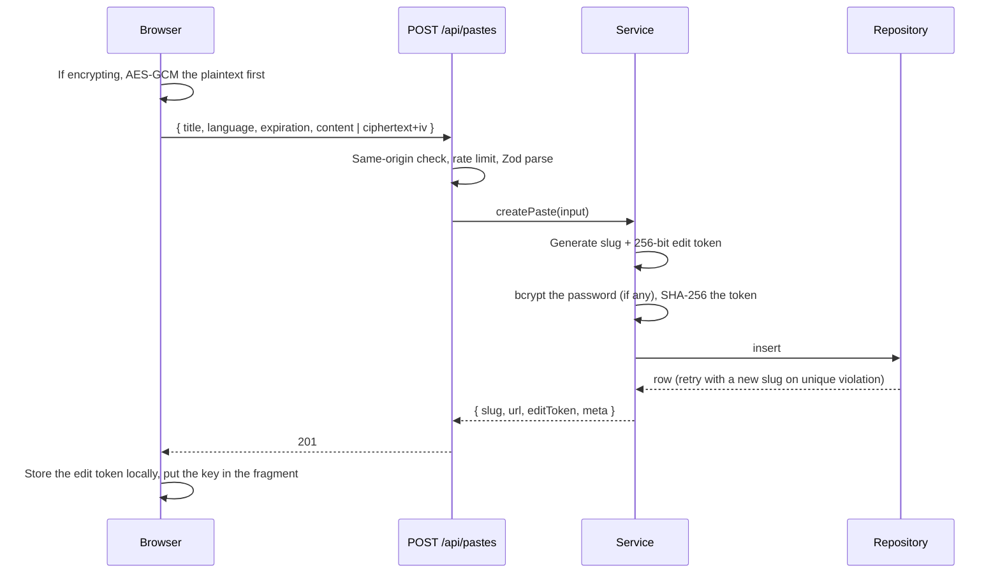
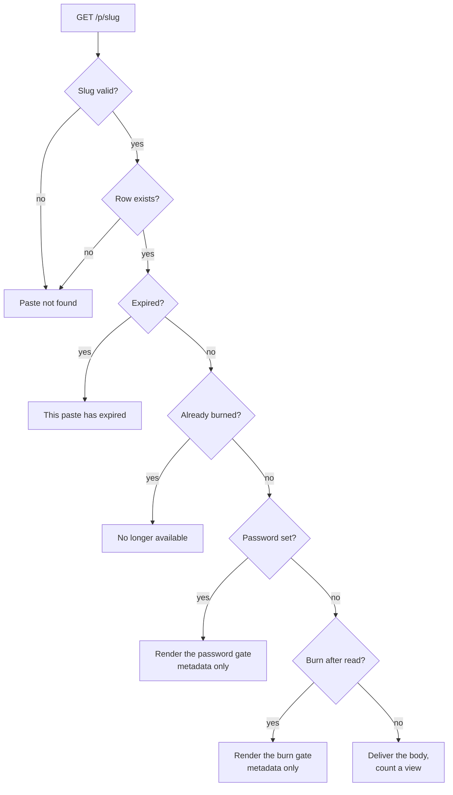
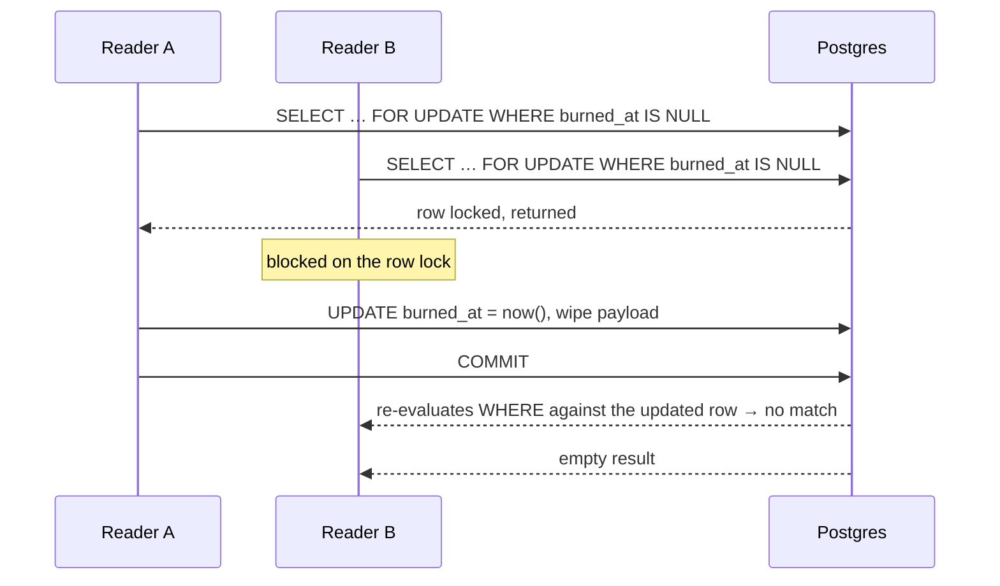

# Architecture

## Shape of the system



Every read and write passes through `lib/paste/service.ts`. That is the design's load-bearing
decision: expiry, burn state, password verification and edit-token authorisation live in one module,
so an individual route cannot forget one of them.

## Layers

| Layer | Location | Responsibility |
| --- | --- | --- |
| Routes | `app/**` | HTTP shape only — parse params, call the service, format the response |
| Guards | `lib/api/guards.ts` | Same-origin check, rate limiting, edit-token extraction |
| Validation | `lib/validation/paste.ts` | Zod schemas at every server boundary |
| Service | `lib/paste/service.ts` | All access rules, all business logic |
| Repository | `lib/db/*` | Storage, and nothing else |
| Client helpers | `lib/client/*` | Browser-only concerns: history, fetch, clipboard, theme |

Nothing below the service layer knows about HTTP; nothing above it knows about SQL.

## Request flows

### Creating a paste



The raw edit token is returned exactly once and is never persisted.

### Reading a paste



The two gates are the reason the page is split: the server component renders metadata, and the body
arrives only after a client-initiated `POST` that proves the visitor should have it.

### Burn-after-read concurrency



Under READ COMMITTED, a blocked `FOR UPDATE` re-checks its `WHERE` clause after the lock is
released. `burned_at IS NULL` is now false, so reader B matches nothing. The in-memory
implementation gets the same property from Node's single-threaded execution: the check and the wipe
cannot interleave.

## Storage abstraction

```ts
interface PasteRepository {
  driver: 'supabase' | 'memory';
  create(record): Promise<PasteRecord | null>;   // null = slug collision
  findBySlug(slug): Promise<PasteRecord | null>;
  update(slug, patch): Promise<PasteRecord | null>;
  delete(slug): Promise<boolean>;
  consumeBurn(slug): Promise<BurnedContent | null>; // atomic claim
  incrementViews(slug): Promise<void>;
  deleteExpired(now?): Promise<number>;
}
```

`lib/db/index.ts` picks an implementation:

1. `TINYPASTE_DB_DRIVER` if set.
2. Otherwise Supabase when both the URL and service-role key are present.
3. Otherwise the in-memory store — which **throws** in a production build unless
   `TINYPASTE_ALLOW_MEMORY_DB=true`, so volatile storage can never become production storage by
   accident. When it is active, a banner appears on every page.

The instance is cached on `globalThis` so a hot reload does not discard dev data or leak Supabase
clients.

## Data model

One table, `pastes`, with three groups of columns:

| Group | Columns | Who may see them |
| --- | --- | --- |
| Public metadata | `slug`, `title`, `language`, `created_at`, `updated_at`, `expires_at`, `is_encrypted`, `burn_after_read`, `views`, `content_size` | Anyone with the link |
| Protected payload | `content`, `encrypted_content`, `encryption_iv`, `encryption_version` | Only after every access check passes |
| Secrets | `password_hash`, `edit_token_hash` | Never leaves the server |

`toMetadata()` in the service is the only function that builds a client-facing projection, and it
lists fields explicitly rather than deleting them from the row — so a new secret column cannot leak
by being forgotten. The internal `id` (a UUID) is never exposed; the public identifier is always the
slug.

Database-level invariants:

- `pastes_payload_shape` — a row holds plaintext or ciphertext, never both.
- `pastes_encryption_excludes_password` — mirrors the version-1 rule in SQL.
- `pastes_slug_shape`, `pastes_title_length` — defence in depth behind the Zod schemas.

## Rendering strategy

- **Server components** render the paste page shell, metadata and static pages.
- **Client components** handle the editor, the gates, decryption and all actions.
- **Syntax highlighting runs in the browser.** Encrypted and password-protected pastes only ever
  hold plaintext locally, so one client-side `CodeBlock` serves every case rather than maintaining a
  second, divergent server render path. Unhighlighted text paints immediately and is upgraded when
  the grammar chunk arrives.
- **Grammars are loaded one at a time** through an explicit map in `lib/paste/grammars.ts`. A
  templated dynamic import would pull the whole ~2 MB grammar directory into the build.
- **Both themes are highlighted at once.** Shiki emits `--shiki-light` and `--shiki-dark` custom
  properties per token, so switching theme is pure CSS with no re-highlight.

## Client state

| Concern | Mechanism | Why |
| --- | --- | --- |
| Paste history + edit tokens | `localStorage`, read through `useSyncExternalStore` | Survives reloads; the store gives React a stable snapshot and a clean hydration story |
| Theme | `localStorage` + an inline bootstrap script | The script applies the class before first paint, so there is no flash |
| Encryption key | `window.location.hash` only | Fragments are never transmitted |
| Fork seed | A module-level variable | Forked content can be decrypted plaintext, so it must not touch storage, history or a Referer header |

## API

| Method | Path | Purpose |
| --- | --- | --- |
| `POST` | `/api/pastes` | Create. Returns the edit token once |
| `GET` | `/api/pastes/[slug]` | Metadata + body for pastes needing no server-side secret. `?count=1` counts a view; `?edit=1` with a token returns the body for editing |
| `POST` | `/api/pastes/[slug]/unlock` | Exchange a password for the body |
| `POST` | `/api/pastes/[slug]/reveal` | Consume a burn-after-read paste |
| `PATCH` | `/api/pastes/[slug]` | Edit. Requires the edit token |
| `DELETE` | `/api/pastes/[slug]` | Delete. Requires the edit token |
| `POST` | `/api/cleanup` | Remove expired rows. Requires `CLEANUP_SECRET` |
| `GET` | `/p/[slug]/raw` | Plain text |
| `GET` | `/p/[slug]/download` | Attachment |

There is deliberately **no listing endpoint**. Nothing can enumerate pastes, which is why "Recent"
is a browser-local feature.

Edit tokens travel in the `x-tinypaste-edit-token` header rather than the URL, so they never land in
browser history, a Referer header, or a server access log.

Errors share one shape:

```json
{ "error": { "code": "PASTE_EXPIRED", "message": "This paste has expired." } }
```

Codes come from a closed set in `lib/errors.ts`. Unexpected failures are logged with an operation
name and a request id and return a generic 500 — never a stack trace.
