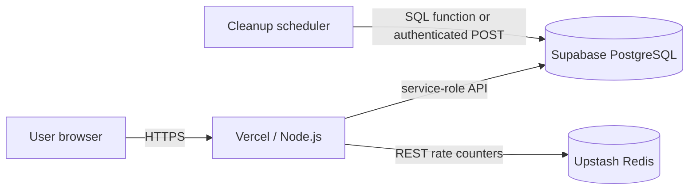

# Deployment guide

The reference deployment is **Vercel + Supabase + Upstash**:

- Vercel runs the Next.js Node application.
- Supabase stores paste rows and provides atomic database functions.
- Upstash shares rate-limit counters across serverless instances.

Other Node.js hosts work if they support `npm run build` / `npm run start`, persistent environment
secrets, HTTPS, and correctly forwarded proxy headers.

## Production topology



## 1. Preflight the repository

Run the full local gate:

```bash
npm ci
npm run check
npm run test:e2e
```

`npm run test:e2e` expects a production build; `npm run check` creates it. The E2E suite uses the
memory repository and needs no production credentials.

Before pushing, inspect tracked environment files:

```bash
git ls-files ".env*"
```

Only the example file should be tracked. Also inspect the pending diff and confirm no keys, tokens,
paste content, test artifacts, or `.data` snapshots are included.

## 2. Provision and verify Supabase

Follow [SUPABASE_SETUP.md](SUPABASE_SETUP.md) completely:

1. create a production-only project;
2. apply `0001_init.sql` and `0002_content_types.sql` in order;
3. verify forced RLS, zero browser policies, and revoked table/function privileges;
4. test the anon/publishable key against PostgREST.

Do not deploy the application until that direct browser-key check returns no rows.

## 3. Import into Vercel

1. Push the repository to a private or public Git provider.
2. In Vercel, choose **Add New → Project** and import it.
3. Keep the detected **Next.js** framework preset.
4. Keep the standard install/build/output settings unless your repository layout requires otherwise.
5. Configure environment variables before the first public deployment.

## 4. Configure production environment

Set these in Vercel **Project Settings → Environment Variables**:

| Variable | Requirement | Production value |
| --- | --- | --- |
| `NEXT_PUBLIC_SUPABASE_URL` | Required | Production project URL |
| `SUPABASE_SERVICE_ROLE_KEY` | Required, secret | Production service-role/secret key |
| `NEXT_PUBLIC_SUPABASE_ANON_KEY` | Optional | Production anon/publishable key |
| `APP_URL` | Required | Exact public HTTPS origin, no trailing slash |
| `RATE_LIMIT_REDIS_URL` | Strongly recommended | Upstash REST URL |
| `RATE_LIMIT_REDIS_TOKEN` | Strongly recommended, secret | Upstash REST token |
| `CLEANUP_SECRET` | Required for HTTP cleanup | Long random bearer secret |
| `ABUSE_CONTACT_EMAIL` | Recommended | Monitored operator address |
| `NEXT_PUBLIC_REPOSITORY_URL` | Optional | Footer source-code link |
| `RATE_LIMIT_CREATE` | Optional | Override default create count |
| `RATE_LIMIT_UNLOCK` | Optional | Override default unlock count |
| `RATE_LIMIT_MUTATE` | Optional | Override default mutation count |

Generate a cleanup secret locally:

```bash
node -e "console.log(require('node:crypto').randomBytes(32).toString('base64url'))"
```

Production safety rules:

- Do not set `TINYPASTE_DB_DRIVER=memory`.
- Do not set `TINYPASTE_ALLOW_MEMORY_DB=true`.
- Do not expose the service-role key through a `NEXT_PUBLIC_` variable.
- Scope production secrets to Production. Give Preview a separate database/key set or leave database
  previews intentionally unavailable.

## 5. Configure distributed rate limiting

Without Upstash, each running instance owns a separate fixed-window counter. That is acceptable for
local development but weakens enforcement on autoscaling infrastructure.

1. Create an Upstash Redis database.
2. Copy its **REST URL** and **REST token**.
3. Set both rate-limit variables.
4. Redeploy.

TinyPaste uses the shared adapter only when both values exist. A Redis outage falls back to the local
limiter and logs an error, keeping paste access available.

## 6. Deploy

Trigger the first deployment and inspect build/runtime logs. A successful build is necessary but not
sufficient: open the deployed home page and confirm there is no **Temporary storage** banner.

Common blockers:

| Signal | Meaning |
| --- | --- |
| TypeScript/lint/test failure | Local quality gate was not clean or environment differs |
| `STORAGE_UNAVAILABLE` | Supabase variables are absent, malformed, or scoped incorrectly |
| Temporary-storage banner | Production has been explicitly allowed to use memory; remove that configuration |
| Missing `content_type` | `0002_content_types.sql` was not applied |
| CSP/worker errors in browser | Security headers or self-hosted Monaco assets did not deploy as built |

## 7. Set the canonical URL

`APP_URL` builds the URL returned from paste creation. It must match the final custom domain:

```dotenv
APP_URL=https://paste.example.com
```

After adding or changing a domain, update the variable and redeploy. A wrong value produces share
links for the wrong host even though the current page itself loads.

## 8. Schedule cleanup

Expired pastes are unreadable immediately, whether cleanup runs or not. Cleanup reduces retention at
rest.

### Recommended: Supabase pg_cron

Use the schedule in [Supabase setup](SUPABASE_SETUP.md#10-schedule-expired-row-cleanup). It calls the
database function directly and does not expose another network secret.

### Alternative: authenticated HTTP scheduler

Set `CLEANUP_SECRET` and schedule:

```bash
curl --fail --request POST "https://paste.example.com/api/cleanup" \
  --header "Authorization: Bearer YOUR_CLEANUP_SECRET"
```

The built-in route accepts POST only. Vercel Cron invokes configured paths with GET, so a plain
`vercel.json` cron entry cannot call this route directly. Use pg_cron or a scheduler capable of an
authenticated POST.

Monitor the scheduler separately; a missed cleanup does not make expired content readable, but it
does extend at-rest retention.

## 9. Production acceptance checklist

Run these checks against the deployed domain with disposable content.

### Storage and basic flow

- [ ] Home page has no temporary-storage warning.
- [ ] Create a code paste; it opens after refresh and after a new deployment.
- [ ] Raw returns `text/plain`; download is an attachment with a safe filename.
- [ ] Recent shows the paste only in the browser that created it.

### All three content types

- [ ] Code mode highlights a supported language and copy preserves exact source.
- [ ] Plain-text mode does not syntax-highlight.
- [ ] Document mode preserves headings, lists, safe links, marks, and alignment.
- [ ] Document copy offers rich content with plain-text fallback.
- [ ] Document HTML/Markdown export is local; direct raw/download routes refuse the document.

### Password and ownership

- [ ] A password paste initially exposes metadata only.
- [ ] Wrong password fails; correct password reveals; password never appears in a URL.
- [ ] Raw/download refuse password-protected content.
- [ ] Creating browser can edit/delete; a private browser cannot.
- [ ] Forged/missing edit-token API requests are rejected.

### Burn and expiration

- [ ] Creator landing page does not consume a burn paste.
- [ ] First explicit reveal succeeds and a second attempt fails.
- [ ] Payload columns are wiped and `burned_at` is set.
- [ ] Raw/download do not consume a burn paste.
- [ ] Expired content is refused even before cleanup deletes its row.

### Browser encryption

- [ ] Create encrypted code and encrypted document pastes.
- [ ] Network request bodies contain ciphertext and never recognisable plaintext.
- [ ] The fragment key appears in no request URL, body, header, or cookie.
- [ ] Database rows contain ciphertext and null plaintext.
- [ ] Complete links decrypt; missing, malformed, and wrong keys fail closed.
- [ ] Edit remains encrypted and preserves the original content type.

### Security and privacy

- [ ] A script/HTML payload renders as text and does not execute.
- [ ] Unsafe document links are rejected.
- [ ] Home, raw, and download responses carry their intended security headers.
- [ ] Paste pages are `noindex` and do not put user titles in page metadata.
- [ ] Direct Supabase requests with the anon/publishable key return no rows.
- [ ] Footer abuse link reaches a monitored address.
- [ ] Rate-limit counters are visible in the configured shared store.

## 10. Monitoring and operations

At minimum, monitor:

- deployment failures and server error rate;
- `STORAGE_UNAVAILABLE` and rate-limiter fallback logs;
- Supabase availability, database size, and function errors;
- cleanup job success and last run;
- abuse/security mailbox;
- dependency and platform security advisories.

Do not add request-body logging, session replay, or analytics that capture paste URLs/content without
revisiting the product's privacy model and documentation.

## Deploying on another Node host

```bash
npm ci
npm run build
npm run start
```

Requirements:

- a Node.js runtime compatible with the installed Next.js release;
- HTTPS (clipboard APIs and confidentiality depend on a secure context);
- persistent environment variables/secrets;
- `X-Forwarded-For` containing the real client chain for useful rate limits;
- `X-Forwarded-Host` preserving the public host for same-origin checks;
- a scheduler for SQL cleanup or authenticated POST cleanup.

TinyPaste is not an edge-only application: bcryptjs, Node crypto usage, and route runtime declarations
expect Node.js. Containerisation is optional and no Dockerfile is maintained in this repository.

## Rollback and recovery

Application rollback and database rollback are separate operations.

- Vercel can promote an earlier deployment.
- Do not delete or reverse a migration merely because application code was rolled back.
- `0002_content_types.sql` is additive and backfills legacy rows, so older code can continue reading
  the original payload columns; test this before relying on it for future migrations.
- Back up/restore decisions may reintroduce deleted, expired, or burned metadata/content. Document
  that privacy impact in any recovery event.
- Rotate the service-role, Upstash, or cleanup secret immediately if exposed, then redeploy every
  environment that used it.

For a security incident, preserve only the minimum logs required, disable the affected surface if
necessary, rotate credentials, verify RLS/privileges, and notify affected operators/users according
to applicable policy.
